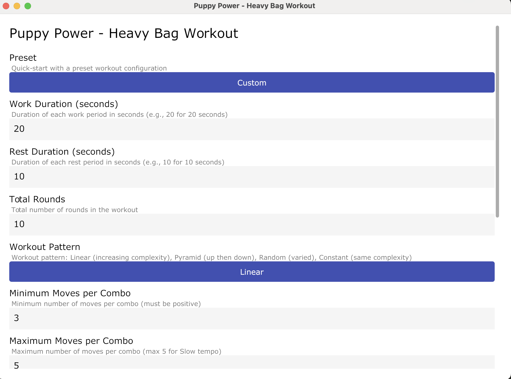
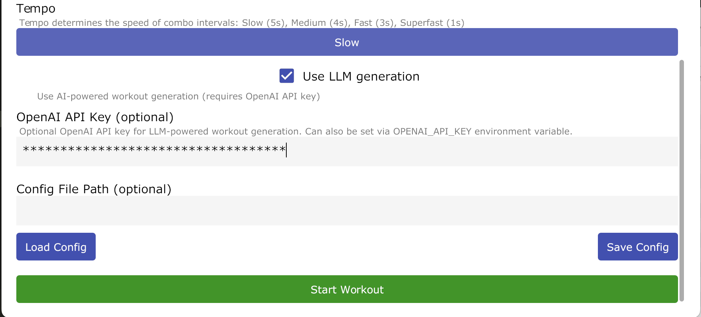
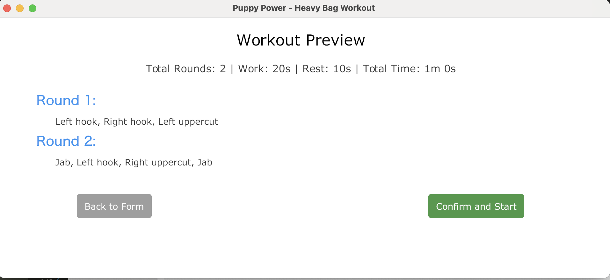
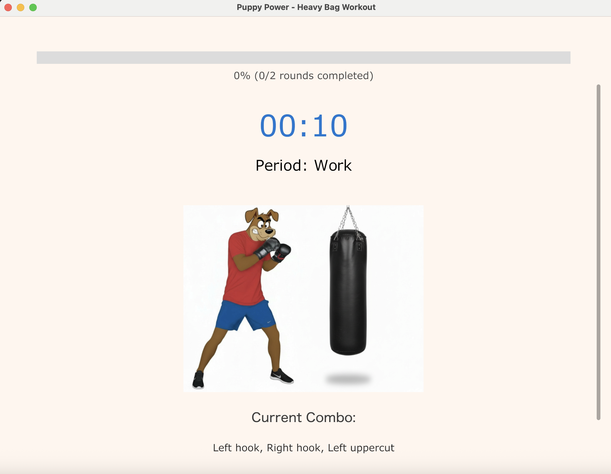

# Puppy Power - Heavy Bag Workout App

A Go-based application that generates randomized boxing workouts with combinations of punches and defensive moves. The app provides both a **graphical user interface (GUI)** with animated character sprites and a **command-line interface (CLI)** for heavy bag training with customizable workout patterns, timing, and audio cues.

## Screenshots

### GUI Interface


*Main configuration screen with form interface for setting workout parameters*


*Configuration screen showing LLM generation option enabled*


*Preview and confirmation screen showing generated workout before starting*


*Active workout display with animated character sprites performing combos*

## Features

### Core Workout Features
- **6 Boxing Punches**: Jab, Cross, Lead Hook, Rear Hook, Lead Uppercut, Rear Uppercut
- **6 Defensive Moves**: Left Slip, Right Slip, Left Roll, Right Roll, Pull Back, Duck
- **Randomized Workouts**: Generates unique combinations of punches and defensive moves
- **Workout Patterns**: Choose from linear, pyramid, random, or constant complexity patterns
- **Stance Support**: Full support for both right-handed (orthodox) and left-handed (southpaw) boxers with stance-specific punch naming
- **Configurable Timing**: Customize work and rest periods per round
- **Preset Configurations**: Quick-start with pre-configured workouts (beta_style, endurance, power)
- **LLM Integration**: Optional AI-powered workout generation using OpenAI's GPT models
- **Configuration Files**: JSON-based configuration for custom workout setups

### GUI Features
- **Visual Workout Display**: Animated character sprites showing boxing moves in real-time
- **Form-Based Configuration**: Intuitive form interface for setting workout parameters
- **Tempo-Based Animations**: Animations synchronized with selected tempo (Slow, Medium, Fast, Superfast)
- **Pause/Resume**: Pause and resume workouts at any time
- **Workout Preview**: Preview all combos before starting
- **Visual Feedback**: "Go!" indicator and progress tracking
- **Stance-Aware Animations**: Visual animations adapt to orthodox/southpaw stance

### CLI Features
- **Interactive Terminal Display**: Real-time workout display with progress tracking
- **Audio Cues**: 
  - Beep at configurable intervals during work periods (default: 5 seconds, adjustable via `--tempo`)
  - Voice announcements for period transitions ("work", "rest")
  - Combo callouts at the start of each round
  - "Workout complete" announcement at the end
  - 3 beeps in the last 3 seconds of rest periods to signal readiness
- **Audio Recording**: Save entire workout audio to file (MP3, M4A, WAV)
- **Command-Line Flags**: Full control via command-line arguments

## Project Structure

```
HeavyBagWorkout/
├── cmd/
│   └── heavybagworkout/    # Main application entry point
├── internal/
│   ├── models/             # Data models (Punch, Combo, Workout, etc.)
│   ├── generator/          # Combo and workout generation logic
│   ├── timer/              # Timer functionality and audio cues
│   ├── config/             # Configuration management
│   ├── cli/                # CLI interface
│   ├── gui/                # GUI interface (Gio UI)
│   └── mocks/              # Generated mocks for testing
├── assets/                 # Animation sprite assets
│   ├── orthodox/           # Orthodox stance sprites
│   └── southpaw/           # Southpaw stance sprites
├── configs/                # Preset configuration files
├── screenshots/            # Application screenshots
├── docs/                   # Documentation
│   ├── TIMER_ARCHITECTURE.md
│   ├── ANIMATION_SYSTEM.md
│   ├── ASSET_REQUIREMENTS.md
│   └── LLM_WORKOUT_GENERATION.md
├── go.mod
├── go.sum
└── README.md
```

## Documentation

Additional documentation is available in the `docs/` directory:

- **[Timer Architecture](docs/TIMER_ARCHITECTURE.md)**: Detailed explanation of the timer system and how it's used in CLI and GUI
- **[Animation System](docs/ANIMATION_SYSTEM.md)**: Architecture of the GUI animation system
- **[Asset Requirements](docs/ASSET_REQUIREMENTS.md)**: Asset file formats, naming conventions, and requirements
- **[LLM Workout Generation](docs/LLM_WORKOUT_GENERATION.md)**: How the AI-powered workout generation works, including prompt generation and the internal feedback mechanism

## Setup Instructions

### Prerequisites

- Go 1.19 or higher
- (Optional) OpenAI API key for LLM-powered workout generation

### Installation

1. Clone the repository:
```bash
git clone <repository-url>
cd HeavyBagWorkout
```

2. Build the application:
```bash
# Build CLI version
go build -o heavybagworkout ./cmd/heavybagworkout

# Or build GUI version
go build -o heavybagworkout-gui ./cmd/heavybagworkout-gui
```

3. Run the application:
```bash
# Run CLI version
./heavybagworkout

# Run GUI version
./heavybagworkout --gui

# Or run directly with Go
go run ./cmd/heavybagworkout          # CLI
go run ./cmd/heavybagworkout --gui    # GUI
```

## Usage

### Quick Start

**GUI Mode** (Recommended for visual experience):
```bash
./heavybagworkout --gui
```

**CLI Mode** (Recommended for terminal-based workouts):
```bash
./heavybagworkout --preset beta_style
```

### Command-Line Flags

| Flag | Description | Example |
|------|-------------|---------|
| `--config` | Path to JSON configuration file | `--config configs/custom.json` |
| `--preset` | Use a preset (beta_style, endurance, power) | `--preset power` |
| `--work-duration` | Work period duration in seconds | `--work-duration 30` |
| `--rest-duration` | Rest period duration in seconds | `--rest-duration 15` |
| `--rounds` | Total number of rounds | `--rounds 10` |
| `--pattern` | Workout pattern (linear, pyramid, random, constant) | `--pattern pyramid` |
| `--min-moves` | Minimum moves per combo | `--min-moves 2` |
| `--max-moves` | Maximum moves per combo | `--max-moves 6` |
| `--include-defensive` | Include defensive moves in combos | `--include-defensive` |
| `--no-include-defensive` | Disable defensive moves | `--no-include-defensive` |
| `--use-llm` | Use LLM for workout generation | `--use-llm` |
| `--openai-api-key` | OpenAI API key | `--openai-api-key sk-...` |
| `--stance` | Boxer's stance (orthodox, southpaw) | `--stance southpaw` |
| `--tempo` | Workout tempo: Slow (5s), Medium (4s), Fast (3s), Superfast (2s) | `--tempo fast` |
| `--save` | Save audio output to file (format determined by extension: .mp3, .m4a, .wav) | `--save workout.m4a` |
| `--version` | Show version information | `--version` |
| `--help` | Show help message | `--help` |

### Configuration Priority

1. **Command-line flags** (highest priority) - Override all other settings
2. **Config file** (`--config`) - Load from custom JSON file
3. **Preset** (`--preset`) - Use predefined configuration
4. **Default configuration** (lowest priority) - Built-in defaults

### Examples

**Basic workout with preset:**
```bash
./heavybagworkout --preset beta_style
```

**Custom workout with specific timing:**
```bash
./heavybagworkout --work-duration 30 --rest-duration 15 --rounds 10
```

**Pyramid pattern with defensive moves:**
```bash
./heavybagworkout --pattern pyramid --min-moves 2 --max-moves 6 --include-defensive
```

**Southpaw stance with LLM generation:**
```bash
./heavybagworkout --preset power --stance southpaw --use-llm
```

**Save audio output to file:**
```bash
./heavybagworkout --preset beta_style --save workout.m4a
```

**Using a custom configuration file:**
```bash
./heavybagworkout --config configs/custom.json
```

## Workout Patterns

The app supports four workout patterns that control how combo complexity varies across rounds:

- **Linear**: Combo complexity increases linearly from round 1 to the final round
  - Round 1: Simpler combos (closer to min moves)
  - Final round: More complex combos (closer to max moves)

- **Pyramid**: Combo complexity peaks in the middle rounds
  - Starts simple, increases to peak in middle rounds, then decreases
  - Great for building intensity and then tapering

- **Random**: Combo complexity varies randomly within the min-max range
  - Unpredictable and keeps you on your toes
  - Each round can be different

- **Constant**: Combo complexity remains relatively constant throughout
  - Consistent challenge level across all rounds
  - Good for endurance training

## Stance Support

The app fully supports both boxing stances:

- **Orthodox** (right-handed): Default stance
  - Jab = left hand, Cross = right hand
  - Lead Hook = left hook, Rear Hook = right hook
  - Lead Uppercut = left uppercut, Rear Uppercut = right uppercut

- **Southpaw** (left-handed): Mirror stance
  - Jab = right hand, Cross = left hand
  - Lead Hook = right hook, Rear Hook = left hook
  - Lead Uppercut = right uppercut, Rear Uppercut = left uppercut

Defensive moves are automatically paired appropriately with punches based on the selected stance.

## LLM Integration

The app can use OpenAI's GPT models to generate more creative and varied workouts:

1. Set your OpenAI API key:
   ```bash
   export OPENAI_API_KEY=sk-your-key-here
   ```
   Or use the `--openai-api-key` flag

2. Enable LLM generation:
   ```bash
   ./heavybagworkout --use-llm --preset power
   ```

The LLM generator understands:
- Stance-specific punch naming
- Defensive move pairing with punches
- Workout patterns and complexity requirements
- Realistic boxing combinations

## Audio Cues

The app provides audio feedback during workouts:

- **Beep at configurable intervals** during work periods as a reminder to execute the combo
  - Default: 5 seconds (Slow tempo)
  - Adjustable via `--tempo` flag: Slow (5s), Medium (4s), Fast (3s), Superfast (2s)
- **"Work"** voice announcement when transitioning to a work period
- **"Rest"** voice announcement when transitioning to a rest period
- **3 beeps** in the last 3 seconds of rest periods to signal readiness for the next work period
- **Combo callout** at the start of each round (speaks the moves)
- **"Workout complete"** announcement when the workout finishes

Audio cues use system text-to-speech and are enabled by default.

### Audio Recording

You can save the entire audio output of a workout to a file using the `--save` flag:

```bash
# For Android (recommended)
./heavybagworkout --preset beta_style --save workout.mp3

# For iOS/iPhone
./heavybagworkout --preset beta_style --save workout.m4a
```

The audio file will contain:
- All beeps during work periods (at tempo intervals)
- Voice announcements ("work", "rest")
- Round number callouts ("round 1 of 50", etc.)
- Combo callouts at the start of each round
- Rest period countdown beeps (last 3 seconds)
- "Workout complete" announcement

**Supported formats:**
- `.mp3` (recommended for Android and universal compatibility - works on all platforms)
- `.m4a` (recommended for iOS/iPhone compatibility, also works on modern Android)
- `.wav` (uncompressed, larger file size, works everywhere but not ideal for mobile)

The format is automatically determined by the file extension. If no extension is provided, the default is `.mp3` (best for Android and universal compatibility).

**Requirements:**
- **ffmpeg**: Required for system audio capture. [Installation instructions](https://ffmpeg.org/download.html)
  - macOS: `brew install ffmpeg`
  - Linux: `sudo apt install ffmpeg` (Debian/Ubuntu) or `sudo yum install ffmpeg` (RHEL/CentOS)
  - Windows: Download from [ffmpeg.org](https://ffmpeg.org/download.html) or use `choco install ffmpeg` (Chocolatey)

**macOS Setup (Required for audio recording):**
The `--save` feature uses system audio capture on macOS, which requires a virtual audio device to route audio output for recording.

1. **Install BlackHole** (free virtual audio driver):
   - Download from: https://github.com/ExistentialAudio/BlackHole
   - Follow installation instructions
   
2. **Configure Audio MIDI Setup**:
   - Open **Audio MIDI Setup** (Applications > Utilities)
   - Create a **Multi-Output Device**:
     - Click "+" → "Create Multi-Output Device"
     - Check both "BlackHole 2ch" and "Built-in Output"
     - Set this as your default output in System Preferences > Sound
   
3. **Grant Permissions**:
   - System Preferences > Security & Privacy > Privacy
   - Grant screen recording and microphone access if prompted

**Note:** This is a temporary implementation. A more portable solution will be implemented in a later development stage.

### Debug Logging

To troubleshoot audio recording issues or see detailed diagnostic information, you can enable debug logging using environment variables:

```bash
# Enable debug logging
HEAVYBAG_DEBUG=1 ./heavybagworkout --preset beta_style --save workout.mp3

# Or use the generic DEBUG flag
DEBUG=1 ./heavybagworkout --preset beta_style --save workout.mp3
```

When enabled, debug logging will show:
- Available audio devices and BlackHole detection
- FFmpeg command being executed
- Recording start/stop status
- Audio file creation and size information

**Example output:**
```
Debug: ffmpeg device list output:
[AVFoundation audio devices:]
[0] Built-in Microphone
[1] BlackHole 2ch
...
Debug: Found BlackHole at device index 1
Debug: Started system audio recording from BlackHole (device 1) to workout.mp3
Debug: ffmpeg command: ffmpeg -f avfoundation -i :1 -acodec libmp3lame ...
Debug: Stopped system audio recording
Debug: Audio file created successfully: workout.mp3 (245760 bytes)
```

## Configuration Files

Configuration files are JSON format. Example structure:

```json
{
  "workout": {
    "work_duration_seconds": 30,
    "rest_duration_seconds": 15,
    "total_rounds": 8
  },
  "pattern": {
    "type": "pyramid",
    "min_moves": 2,
    "max_moves": 7,
    "include_defensive": true
  },
  "generator": {
    "use_llm": false,
    "llm_model": "gpt-4.1-nano"
  },
  "stance": "orthodox",
  "openai_api_key": ""
}
```

### Available Presets

- **beta_style**: Quick, high-intensity rounds
- **endurance**: Longer rounds for stamina building
- **power**: Balanced rounds with defensive moves

## Interactive Controls

### CLI Controls
- **Ctrl+C**: Cancel the workout at any time
- **Enter**: View workout preview before starting

### GUI Controls
- **Start Button**: Begin the workout
- **Pause/Resume Button**: Pause and resume during workout
- **Stop Button**: Stop the workout and return to configuration
- **Preview Button**: View all combos before starting

## Choosing Between GUI and CLI

The application offers two interfaces, each optimized for different use cases:

### GUI Mode (`--gui`)

**Best for:**
- Visual learners who want to see moves demonstrated
- Interactive workouts with animated character sprites
- Form-based configuration (no command-line knowledge needed)
- Real-time visual feedback and progress tracking
- Following along with animated combos

**Key Features:**
- Animated character sprites performing boxing moves
- Form-based configuration interface
- Visual "Go!" indicators and progress bars
- Pause/Resume controls
- Workout preview before starting

### CLI Mode (default)

**Best for:**
- Terminal-based workflows
- Audio recording to files (`--save` flag)
- Headless server environments
- Scriptable/automated workout generation
- Quick command-line configuration

**Key Features:**
- Real-time terminal display with progress tracking
- Audio recording to MP3/M4A/WAV files
- Full command-line flag support
- Lightweight and fast startup
- Perfect for automation

### Quick Comparison

| Feature | GUI | CLI |
|---------|-----|-----|
| Visual Animations | ✅ Yes | ❌ No |
| Audio Recording | ❌ No | ✅ Yes |
| Form Interface | ✅ Yes | ❌ No |
| Command-Line Flags | ✅ Yes (via form) | ✅ Yes |
| Pause/Resume | ✅ Yes | ❌ No |
| Headless Support | ❌ No | ✅ Yes |
| File Output | ❌ No | ✅ Yes |

## Development Status

**V1** 
- CLI (MVP is complete)

**V2** 
- GUI with animations of a Doggy Boxer in fighting poses (Complete)

**Future Enhancements** 
- ability to change boxer avatar in GUI(currently fixed at boxer dog)
- more polished sounds/cool background music scores
- abilitiy to select model in a GUI field (currently defaults to mini can be loaded only from json config)

## License

This project is licensed under the MIT License.

Copyright (c) 2025 Ishan Chopra

Permission is hereby granted, free of charge, to any person obtaining a copy
of this software and associated documentation files (the "Software"), to deal
in the Software without restriction, including without limitation the rights
to use, copy, modify, merge, publish, distribute, sublicense, and/or sell
copies of the Software, and to permit persons to whom the Software is
furnished to do so, subject to the following conditions:

The above copyright notice and this permission notice shall be included in all
copies or substantial portions of the Software.

THE SOFTWARE IS PROVIDED "AS IS", WITHOUT WARRANTY OF ANY KIND, EXPRESS OR
IMPLIED, INCLUDING BUT NOT LIMITED TO THE WARRANTIES OF MERCHANTABILITY,
FITNESS FOR A PARTICULAR PURPOSE AND NONINFRINGEMENT. IN NO EVENT SHALL THE
AUTHORS OR COPYRIGHT HOLDERS BE LIABLE FOR ANY CLAIM, DAMAGES OR OTHER
LIABILITY, WHETHER IN AN ACTION OF CONTRACT, TORT OR OTHERWISE, ARISING FROM,
OUT OF OR IN CONNECTION WITH THE SOFTWARE OR THE USE OR OTHER DEALINGS IN THE
SOFTWARE.
