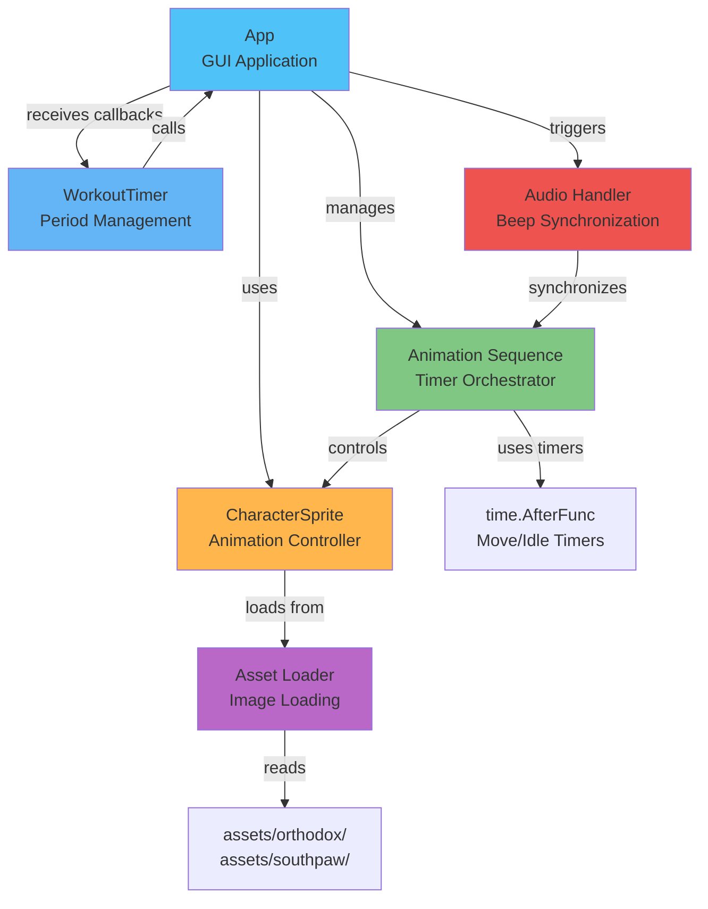
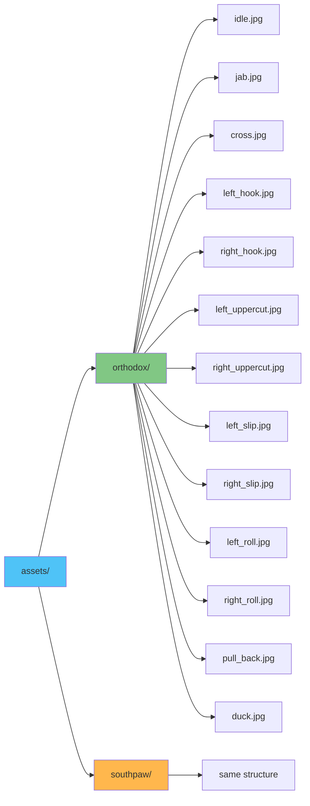
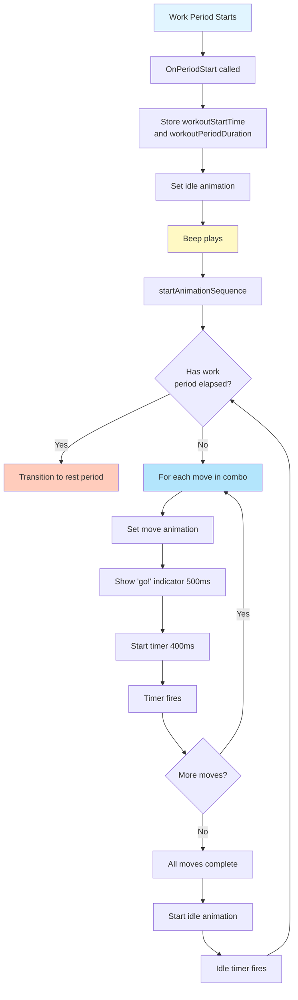
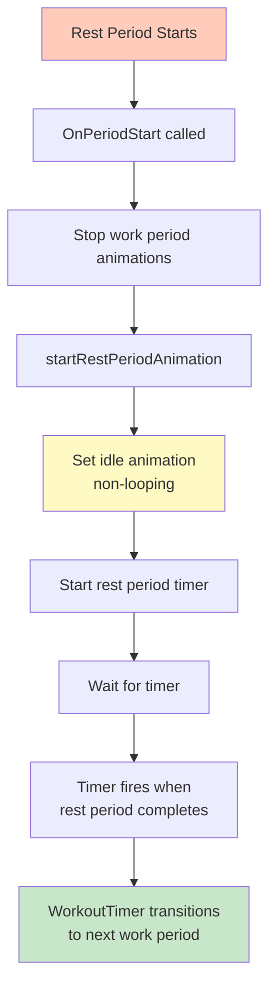

# Animation System Architecture

This document describes the animation system used in the GUI to display character sprites performing boxing moves.

## Overview

The animation system provides visual feedback by displaying animated character sprites (Scrappy Doo) performing the combos in real-time. The system is designed for deterministic, frame-accurate timing synchronized with audio beeps.

### Animation System Architecture

## Core Components

### 1. CharacterSprite (`internal/gui/animation.go`)

The main animation controller that manages character sprite states and frame rendering.

**Key Features:**
- Animation state machine (idle, punches, defensive moves)
- Frame-based animation system
- Stance-aware animations (orthodox vs southpaw)
- Tempo-based timing support
- Asset loading system

**Animation States:**
- `AnimationStateIdle`: Ready/idle pose
- `AnimationStateJabLeft/Right`: Jab animations
- `AnimationStateCrossLeft/Right`: Cross animations
- `AnimationStateLeadHookLeft/Right`: Lead hook animations
- `AnimationStateRearHookLeft/Right`: Rear hook animations
- `AnimationStateLeadUppercutLeft/Right`: Lead uppercut animations
- `AnimationStateRearUppercutLeft/Right`: Rear uppercut animations
- `AnimationStateSlipLeft/Right`: Slip defensive moves
- `AnimationStateRollLeft/Right`: Roll defensive moves
- `AnimationStatePullBack`: Pull back defensive move
- `AnimationStateDuck`: Duck defensive move

### 2. Animation Sequence System (`internal/gui/animation_sequence.go`)

A timer-based system that orchestrates the sequence of animations for a combo.

**Key Features:**
- Deterministic timing using `time.AfterFunc()`
- Single goroutine execution (no race conditions)
- Precise move timing (400ms per move)
- Idle animation between combos
- Work period duration tracking

**Flow:**
1. Beep plays → `startAnimationSequence()` called
2. Check if work period has elapsed
3. Start first move animation with timer
4. Timer fires → move to next move
5. After all moves → start idle animation
6. Idle timer fires → start next combo sequence

### 3. Asset Loader (`internal/gui/assets.go`)

Loads sprite images from the file system.

**Features:**
- Stance-specific asset directories (`assets/orthodox/`, `assets/southpaw/`)
- Format support: JPG (preferred), PNG (fallback)
- Error handling with graceful fallbacks
- Idle animation fallback to jab pose

**Asset Structure:**

## Animation Timing

### Move Timing

Each move in a combo gets exactly **400ms** (`timePerMove`), regardless of tempo:
- This ensures consistent animation speed
- All moves get equal time
- Tempo affects beep intervals, not move speed

### Tempo Intervals

Tempo determines the interval between beeps (combo reminders):
- **Slow**: 5 seconds
- **Medium**: 4 seconds
- **Fast**: 3 seconds
- **Superfast**: 1 second

### Idle Animation

After a combo completes, idle animation plays for the remainder until the next beep:
- `idleDuration = tempoInterval - (numMoves * timePerMove)`
- If combo takes longer than tempo interval, idle duration is 0
- Idle animation is non-looping during work periods

## Animation Flow

### Work Period Flow

### Rest Period Flow

## Synchronization

### Audio Synchronization

Animations are synchronized with audio beeps:
- Beep plays at the start of each combo sequence
- Animation sequence starts immediately when beep plays
- This ensures visual and audio cues are aligned

### Timer Synchronization

The animation system uses multiple timer layers:
1. **WorkoutTimer**: Manages overall workout flow (rounds, periods)
2. **Animation Timers**: Manage individual move and idle durations
3. **Period Check**: At start of each combo, check if work period has elapsed

### Deterministic Execution

The system ensures deterministic behavior:
- Single goroutine for animation sequence (no race conditions)
- Precise timer-based timing (no frame skipping)
- State checks at sequence boundaries
- Clean stop/start transitions

## Stance Support

Animations adapt to the selected stance:

**Orthodox (Right-handed):**
- Jab → Left hand animation
- Cross → Right hand animation
- Lead Hook → Left hook
- Rear Hook → Right hook
- Lead Uppercut → Left uppercut
- Rear Uppercut → Right uppercut

**Southpaw (Left-handed):**
- Jab → Right hand animation
- Cross → Left hand animation
- Lead Hook → Right hook
- Rear Hook → Left hook
- Lead Uppercut → Right uppercut
- Rear Uppercut → Left uppercut

Defensive moves are the same for both stances (no stance-specific variations).

## Error Handling

The animation system includes robust error handling:

1. **Asset Loading Failures**: Falls back to placeholder frames or jab pose
2. **Timer Cancellation**: Clean shutdown when workout stops/pauses
3. **State Validation**: Checks period state before starting animations
4. **Bounds Checking**: Validates combo moves before accessing

## Performance Considerations

1. **Frame Rendering**: Animations use single-frame sprites (not multi-frame sequences)
2. **Timer Efficiency**: Uses `time.AfterFunc()` for efficient timer management
3. **Asset Caching**: Assets are loaded once and reused
4. **Goroutine Management**: Single goroutine per animation sequence prevents overhead

## Future Enhancements

Potential improvements to the animation system:

1. **Multi-Frame Animations**: Support for animated sprite sequences
2. **Transition Effects**: Smooth transitions between moves
3. **Impact Effects**: Visual effects when punches "land"
4. **Performance Optimization**: Frame rate optimization for smoother animations
5. **Animation Variants**: Multiple animation styles for the same move

