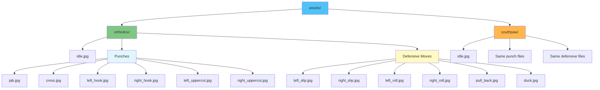
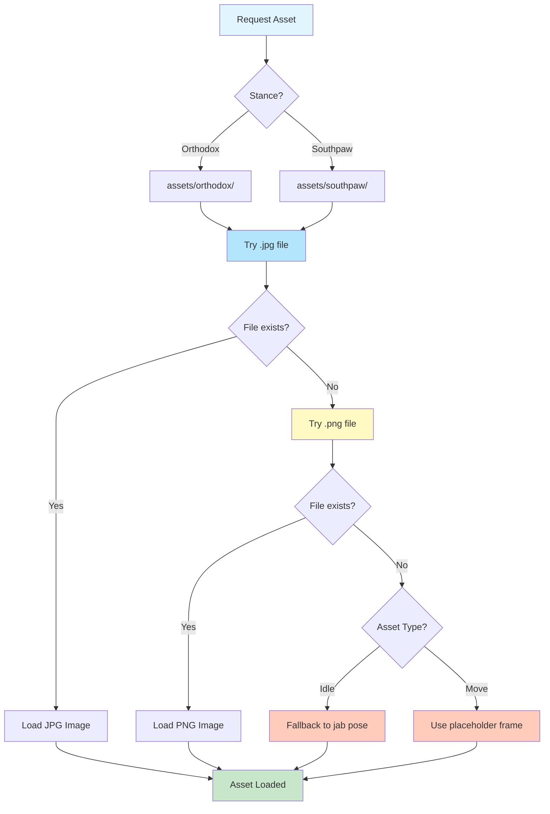

# Asset Requirements and Formats

This document describes the asset requirements for the animation system, including file formats, naming conventions, and organization.

## Asset Directory Structure

Assets are organized by stance in the `assets/` directory:

## File Naming Conventions

### Punch Animations

- `jab.jpg`: Jab punch (stance-specific hand)
- `cross.jpg`: Cross punch (stance-specific hand)
- `left_hook.jpg`: Left hook
- `right_hook.jpg`: Right hook
- `left_uppercut.jpg`: Left uppercut
- `right_uppercut.jpg`: Right uppercut

### Defensive Move Animations

- `left_slip.jpg`: Left slip defensive move
- `right_slip.jpg`: Right slip defensive move
- `left_roll.jpg`: Left roll defensive move
- `right_roll.jpg`: Right roll defensive move
- `pull_back.jpg`: Pull back defensive move
- `duck.jpg`: Duck defensive move

### Idle Animation

- `idle.jpg`: Idle/ready pose

## File Formats

### Supported Formats

1. **JPG/JPEG** (Preferred)
   - Primary format for all assets
   - Better compression for photographic-style sprites
   - Smaller file sizes
   - Good quality for character sprites

2. **PNG** (Fallback)
   - Used if JPG file is not found
   - Better for sprites with transparency (if needed in future)
   - Larger file sizes but lossless

### Format Priority

The asset loader tries formats in this order:
1. `.jpg` (preferred)
2. `.png` (fallback)

## Image Requirements

### Dimensions

- **Recommended**: 200x200 pixels to 400x400 pixels
- **Aspect Ratio**: Square (1:1) recommended
- **Flexible**: System can handle any dimensions, but square works best

### Content Guidelines

1. **Character Pose**: Character should be in the pose for the specific move
2. **Centering**: Character should be centered in the frame
3. **Background**: Transparent or solid color background
4. **Consistency**: All images should have consistent style and scale

### Quality Guidelines

1. **Resolution**: Minimum 200x200, recommended 400x400
2. **File Size**: Keep under 100KB per image for performance
3. **Compression**: Use appropriate JPG quality (80-90% recommended)
4. **Color Space**: sRGB color space

## Stance-Specific Assets

### Orthodox Stance

For orthodox (right-handed) boxers:
- `jab.jpg`: Left hand jab
- `cross.jpg`: Right hand cross
- `left_hook.jpg`: Left hook (lead hook)
- `right_hook.jpg`: Right hook (rear hook)
- `left_uppercut.jpg`: Left uppercut (lead uppercut)
- `right_uppercut.jpg`: Right uppercut (rear uppercut)

### Southpaw Stance

For southpaw (left-handed) boxers:
- `jab.jpg`: Right hand jab
- `cross.jpg`: Left hand cross
- `left_hook.jpg`: Left hook (rear hook)
- `right_hook.jpg`: Right hook (lead hook)
- `left_uppercut.jpg`: Left uppercut (rear uppercut)
- `right_uppercut.jpg`: Right uppercut (lead uppercut)

**Note**: Defensive moves are the same for both stances (no stance-specific variations needed).

## Asset Loading

### Loading Process

### Error Handling

The system gracefully handles missing assets:
- **Missing Move Asset**: Falls back to placeholder frame (empty/nil image)
- **Missing Idle Asset**: Falls back to jab pose
- **Invalid Format**: Attempts PNG if JPG fails
- **File System Errors**: Logs error and continues with placeholder

## Asset Optimization

### Performance Considerations

1. **File Size**: Keep images under 100KB each
2. **Format**: Use JPG for photographic sprites, PNG only if needed
3. **Dimensions**: 200-400px is optimal for most displays
4. **Caching**: Assets are loaded once and cached in memory

### Compression Tips

1. **JPG Quality**: 80-90% provides good balance of quality and size
2. **PNG Optimization**: Use tools like `pngquant` or `optipng` if using PNG
3. **Batch Processing**: Use image processing tools to ensure consistency

## Asset Creation Guidelines

### Creating New Assets

1. **Consistency**: Maintain consistent character scale and positioning
2. **Style**: Keep visual style consistent across all poses
3. **Pose Accuracy**: Ensure poses accurately represent the boxing move
4. **Testing**: Test assets in both orthodox and southpaw contexts

### Asset Validation

Before adding assets:
1. Verify file naming matches conventions
2. Check file format (JPG preferred)
3. Ensure dimensions are appropriate
4. Test loading in the application
5. Verify stance-specific variations are correct

## Future Enhancements

Potential improvements to asset system:

1. **Multi-Frame Animations**: Support for sprite sheets or animation sequences
2. **Asset Bundling**: Bundle assets into single file for distribution
3. **Dynamic Loading**: Load assets on-demand instead of all at once
4. **Asset Variants**: Support for multiple animation styles
5. **Asset Validation**: Automated validation of asset format and naming

