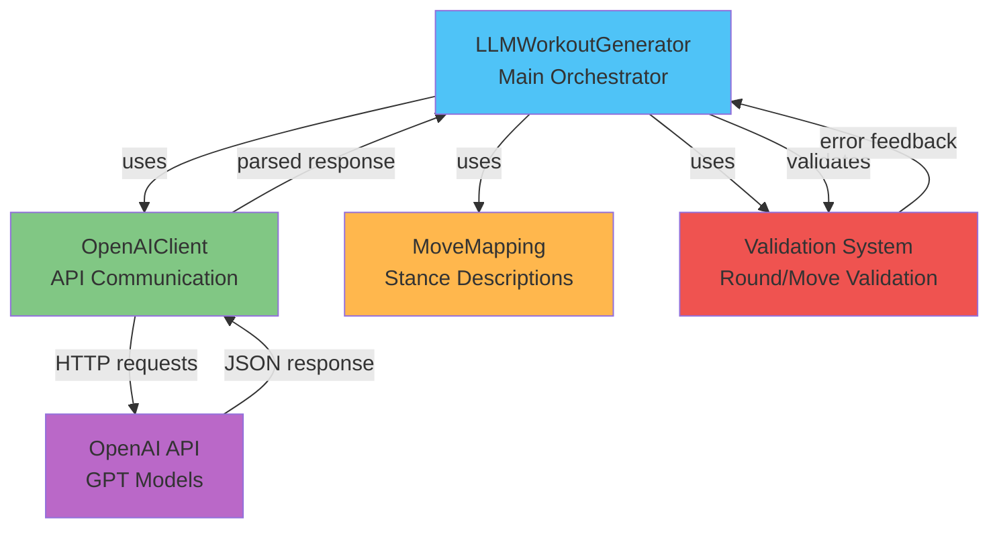
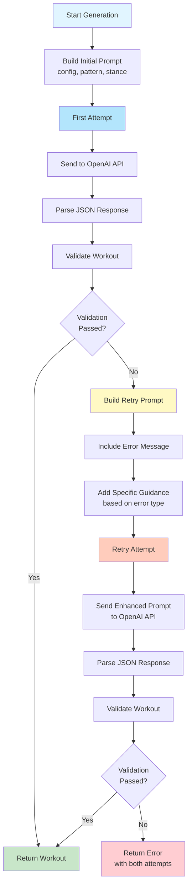
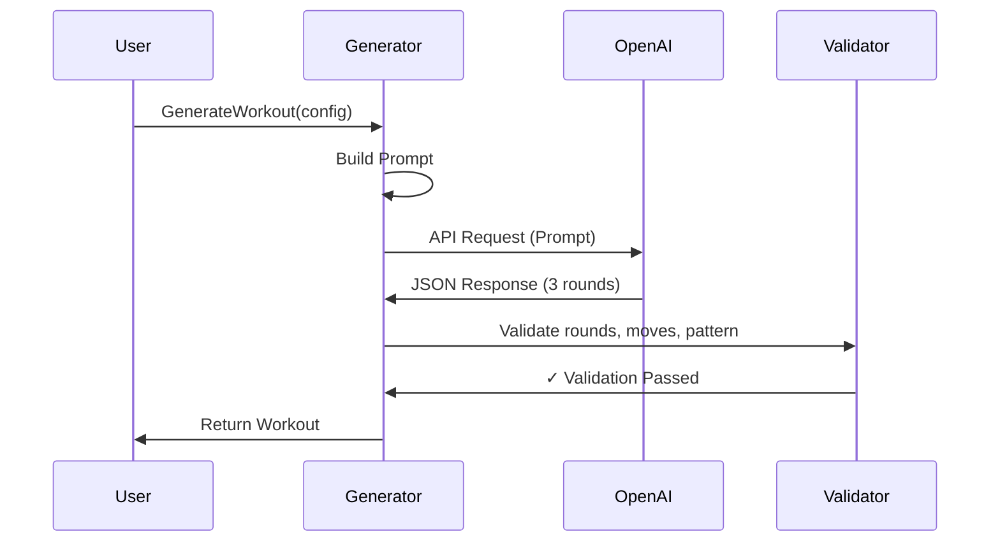
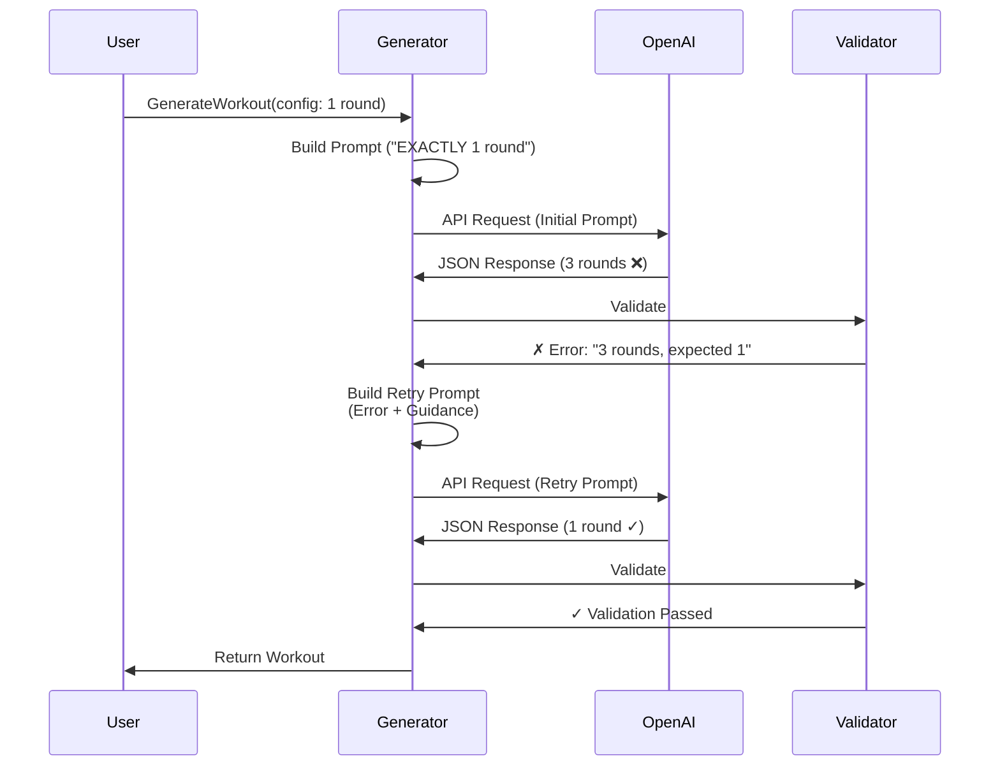

# LLM Workout Generation

This document describes the LLM (Large Language Model) workout generation mechanism, including prompt generation, validation, and the internal feedback system.

## Overview

The LLM workout generator uses OpenAI's API to generate complete workouts based on user-specified configurations. Unlike the in-house generator that uses algorithmic rules, the LLM generator leverages natural language understanding to create more varied and contextually appropriate boxing combinations.

**Key Features:**
- Single API call generates entire workout (all rounds at once)
- Stance-aware generation (Orthodox vs Southpaw)
- Intelligent feedback mechanism for validation failures
- Comprehensive validation ensures workout quality

## Architecture

### Component Diagram



### Components

**LLMWorkoutGenerator** (`internal/generator/llm_workout_generator.go`):
- Main orchestrator for LLM-based workout generation
- Manages prompt construction and API communication
- Handles validation and retry logic

**OpenAIClient** (`internal/generator/openai_client.go`):
- Handles HTTP communication with OpenAI API
- Manages API key authentication
- Parses API responses

**MoveMapping** (`internal/models/move_mapping.go`):
- Provides stance-specific move descriptions for prompts
- Maps move numbers to human-readable names

## Prompt Generation

### Initial Prompt Construction

The prompt is built dynamically based on the workout configuration using `buildWorkoutPrompt()`. The prompt includes:

1. **Move Mappings**: Stance-specific descriptions of all available moves (punches 1-6, defensive moves 7-12)
2. **Workout Configuration**: Total rounds, work duration, rest duration
3. **Pattern Description**: Pattern type (Linear, Pyramid, Random, Constant) with min/max move constraints
4. **Pattern-Specific Instructions**: Detailed rules for each pattern type
5. **Round-by-Round Targets**: Expected move counts for each round
6. **JSON Format Specification**: Example JSON structure with detailed explanations
7. **Guidelines**: Best practices for creating effective boxing combinations

### Prompt Structure

```
Generate a boxing workout with the following specifications:

[MOVE MAPPINGS - Stance-specific punch names and defensive moves]

Workout Configuration:
- Total Rounds: X
- Work Duration: Y seconds
- Rest Duration: Z seconds

CRITICAL: You MUST generate EXACTLY X rounds. No more, no less.

Combo Pattern: [PATTERN_TYPE]
- Minimum moves per combo: X
- Maximum moves per combo: Y
- Include defensive moves: true/false

[PATTERN-SPECIFIC INSTRUCTIONS]

MANDATORY: Each round MUST have the target number of moves specified below:
[ROUND-BY-ROUND TARGETS]

[LINEAR PATTERN SPECIAL RULES - if applicable]

Return the workout in the following JSON format with EXACTLY X rounds:
[JSON EXAMPLE]

[GUIDELINES FOR CREATING EFFECTIVE COMBINATIONS]
```

### Stance-Aware Generation

The prompt adapts based on the boxer's stance:

- **Orthodox (Right-handed)**: 
  - Jab (1) = left hand
  - Cross (2) = right hand
  - Left Hook (3), Right Hook (4), etc.

- **Southpaw (Left-handed)**:
  - Jab (1) = right hand
  - Cross (2) = left hand
  - Different defensive move pairings

The `MoveMapping` provides stance-specific descriptions that help the LLM understand which punches follow which defensive moves for each stance.

### Pattern-Specific Instructions

Each pattern type has detailed instructions:

**Linear Pattern:**
- Emphasizes non-decreasing move count requirement
- Provides examples of how to handle cases where previous round reached max moves
- Includes step-by-step workflow for generating rounds sequentially

**Pyramid Pattern:**
- Explains increasing to peak, then decreasing
- Middle rounds should have maximum moves

**Random Pattern:**
- Encourages variety within min/max constraints

**Constant Pattern:**
- All rounds should have approximately the same number of moves

## Internal Feedback Mechanism

### Two-Stage Generation Process

The LLM generator uses a sophisticated **feedback loop** to improve generation quality:



### Retry Prompt Enhancement

When the first attempt fails validation, the system builds an enhanced retry prompt using `buildWorkoutPromptWithError()`. The retry prompt includes:

1. **Error Header**: Clear indication that the previous attempt failed
2. **Error Message**: The exact validation error from the first attempt
3. **Specific Guidance**: Context-aware instructions based on error type:
   - **Round count errors**: Emphasizes exact round count requirement
   - **Move count errors**: Highlights min/max constraints
   - **Linear pattern errors**: Reinforces non-decreasing requirement
4. **Original Prompt**: All original instructions are preserved

### Error-Specific Guidance

The retry mechanism analyzes the error message and provides targeted guidance:

**Round Count Errors:**
```
- Generate EXACTLY X rounds, no more and no less
- Include round numbers 1 through X in your JSON response
- Do not skip any round numbers
- Do not include extra rounds beyond what was requested
```

**Move Count Errors:**
```
- Never exceed X moves in any combo
- Never go below Y moves in any combo
```

**Linear Pattern Errors:**
```
- Check each round against the previous round's move count
- Ensure each round has equal or MORE moves than the previous round
- If a previous round had 4 moves, the current round MUST also have 4 moves
```

## Validation

### Multi-Layer Validation

The generated workout undergoes comprehensive validation:

1. **Round Count Validation**: Ensures exactly `TotalRounds` rounds are generated
2. **Round Number Validation**: Checks for valid, sequential round numbers (1, 2, 3, ..., TotalRounds)
3. **Duplicate Detection**: Prevents duplicate round numbers
4. **Move Validation**: Verifies all move numbers are valid (1-6 for punches, 7-12 for defensive moves)
5. **Move Count Validation**: Ensures each combo has moves within min/max bounds
6. **Pattern-Specific Validation**: 
   - Linear pattern: Enforces non-decreasing move count progression
   - Validates against expected moves per round with ±1 tolerance
7. **Final Safety Check**: Confirms final workout has correct number of rounds

### Round Processing Order

The system processes rounds in a specific order to ensure correctness:

1. **Collection Phase**: All rounds from LLM response are collected into a map
2. **Validation Phase**: Round numbers are validated (range, duplicates)
3. **Sequential Processing**: Rounds are processed in order (1, 2, 3, ..., TotalRounds)
4. **Pattern Validation**: As rounds are processed, pattern-specific rules are checked (e.g., linear non-decreasing)

This ensures that even if the LLM returns rounds out of order, they are processed correctly.

## Example Flow

### Successful Generation



### Generation with Retry



## Benefits of Feedback Mechanism

1. **Self-Correction**: LLM can fix mistakes when given specific error feedback
2. **Reduced API Calls**: Most issues resolved in one retry, avoiding user frustration
3. **Better Quality**: Error-specific guidance helps LLM understand exact requirements
4. **Transparency**: Error messages are clear and actionable

## Configuration Requirements

### OpenAI API Key

The LLM generator requires an OpenAI API key:
- Can be provided via GUI input field
- Can be set via environment variable (`OPENAI_API_KEY`)
- Can be stored in config file

### API Costs

- Each workout generation uses 1-2 API calls (initial + optional retry)
- Token usage depends on prompt length and response size
- Prompt length varies based on:
  - Number of rounds (more rounds = longer prompt)
  - Pattern type (Linear has more instructions)
  - Whether defensive moves are included

## Comparison with In-House Generator

| Feature | LLM Generator | In-House Generator |
|---------|---------------|-------------------|
| **Variety** | High - creative combinations | Medium - algorithmic |
| **Stance Awareness** | Yes - understands boxing context | Yes - but simpler |
| **API Dependency** | Yes - requires OpenAI API | No |
| **Cost** | Per-request API costs | Free |
| **Speed** | Network latency (1-5 seconds) | Instant |
| **Reliability** | Depends on API availability | Always available |
| **Validation** | Comprehensive with retry | Built-in validation |

## Best Practices

1. **Always Validate**: The system validates all generated workouts before returning them
2. **Handle Errors Gracefully**: If retry fails, return clear error message to user
3. **Monitor API Usage**: Track API calls to manage costs
4. **Fallback Option**: Consider in-house generator as fallback if API unavailable
5. **Prompt Optimization**: Keep prompts clear and specific to reduce retry rate

## Future Improvements

Potential enhancements to the LLM generation system:

1. **Prompt Caching**: Cache common prompt templates to reduce construction overhead
2. **Multi-Model Support**: Support for other LLM providers (Claude, Gemini, etc.)
3. **Streaming Responses**: Stream partial responses for better UX
4. **Prompt Templates**: Allow users to customize prompt style
5. **Analytics**: Track success rates, common failure modes, retry patterns
6. **Fine-Tuning**: Fine-tune model on validated workouts for better accuracy
7. **Batch Generation**: Generate multiple workout variations in single API call

