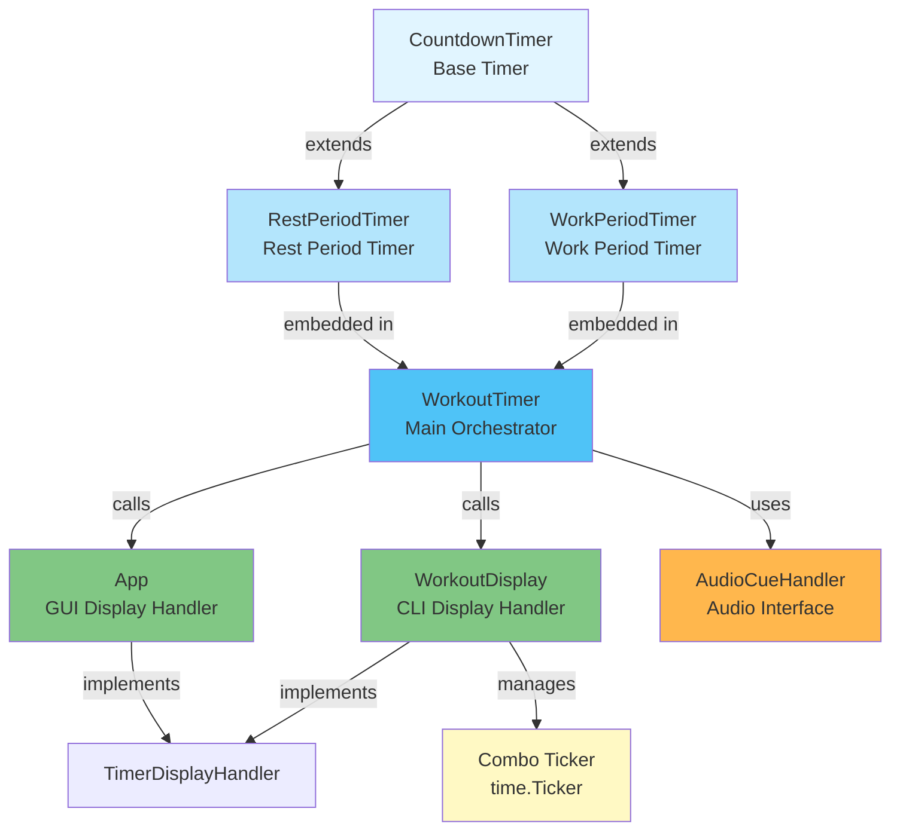
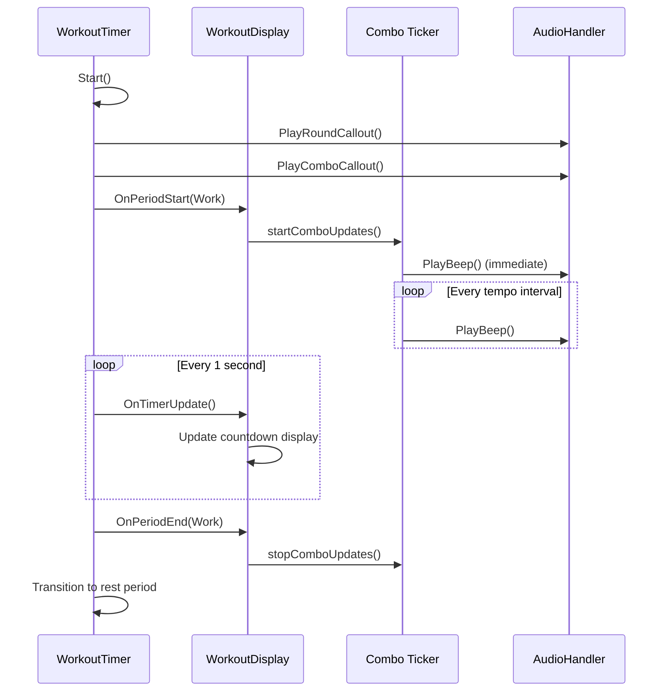
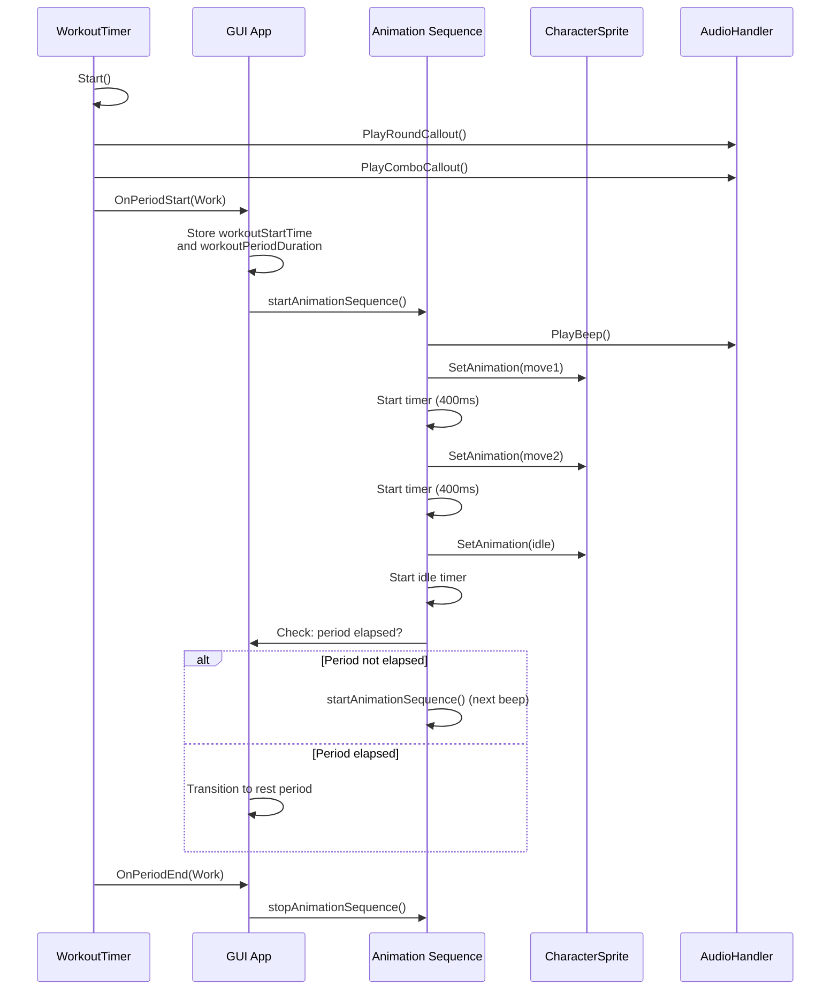
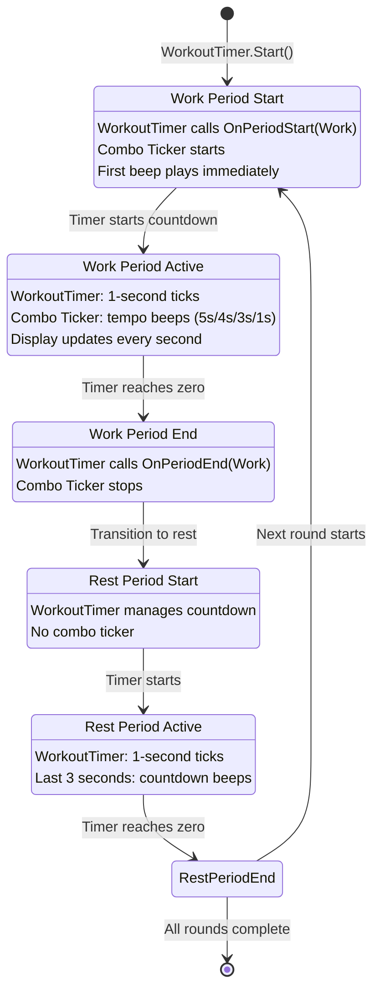
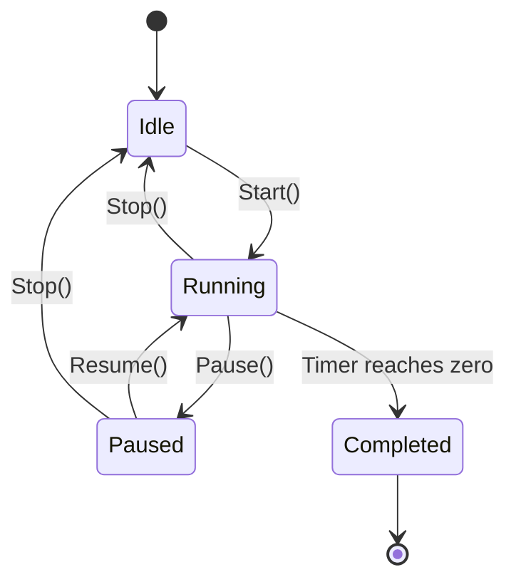

# Timer Architecture

This document describes the timer system architecture and how it's used in both the CLI and GUI interfaces.

## Overview

The timer system consists of several components that work together to manage workout timing, period transitions, and synchronization with audio cues and visual displays.

### Timer Component Dependency Graph



## Core Timer Components

### 1. CountdownTimer (`internal/timer/countdown_timer.go`)

A generic countdown timer that can be started, paused, resumed, and stopped. It provides:
- **States**: Idle, Running, Paused, Completed
- **Callbacks**: `OnTick()` (called every second) and `OnComplete()` (called when timer reaches zero)
- **Context-based cancellation**: Uses Go's context package for clean shutdown

**Key Features:**
- Accurate time tracking even when paused
- Thread-safe state management
- Support for resume from paused state

### 2. WorkPeriodTimer (`internal/timer/workout_timer.go` - embedded)

A specialized timer for work periods that extends `CountdownTimer`:
- Tracks work period duration
- Provides callbacks for tick updates and completion
- Used internally by `WorkoutTimer` to manage work periods

### 3. RestPeriodTimer (`internal/timer/workout_timer.go` - embedded)

A specialized timer for rest periods that extends `CountdownTimer`:
- Tracks rest period duration
- Provides callbacks for tick updates and completion
- Handles countdown beeps in the last 3 seconds
- Used internally by `WorkoutTimer` to manage rest periods

### 4. WorkoutTimer (`internal/timer/workout_timer.go`)

The main orchestrator that manages the entire workout flow:

**Responsibilities:**
- Coordinates work and rest periods
- Manages round progression
- Handles period transitions
- Integrates with display and audio handlers
- Provides pause/resume/stop functionality

**Key Methods:**
- `Start()`: Begins the workout, starts first work period
- `Pause()`: Pauses current period timer
- `Resume()`: Resumes paused timer
- `Stop()`: Stops all timers and cancels audio
- `CurrentRound()`: Returns current round number (1-indexed)
- `CurrentPeriod()`: Returns current period type (Work/Rest)
- `RemainingTime()`: Returns remaining time in current period

**Handler Interfaces:**
- `TimerDisplayHandler`: For UI updates (CLI and GUI)
- `AudioCueHandler`: For audio cues (beeps, announcements)

## Timer Usage in CLI

### Architecture

The CLI uses `WorkoutTimer` directly and implements `TimerDisplayHandler`:

```go
// CLI creates WorkoutTimer
workoutTimer := timer.NewWorkoutTimer(workout)
workoutTimer.SetDisplayHandler(cliDisplay)
workoutTimer.SetAudioHandler(audioHandler)
workoutTimer.Start()
```

### Why CLI Uses Timers

The CLI uses timers for **determinism and synchronization**:

1. **Deterministic Timing**: The `WorkoutTimer` ensures precise timing for:
   - Work period countdown
   - Rest period countdown
   - Period transitions
   - Round progression

2. **Synchronization with Beeps**: The timer system ensures beeps play at exact intervals:
   - **Work period beeps**: The `WorkoutTimer` calls `OnPeriodStart()` when a work period begins, which triggers the CLI to start its tempo-based ticker. The ticker then plays beeps at exact tempo intervals (5s, 4s, 3s, or 1s). While the beeps themselves use a separate ticker (not the 1-second timer ticks), they are synchronized with the period start - the ticker only starts when `OnPeriodStart()` is called, ensuring beeps align with the workout period boundaries.
   - **Rest period countdown beeps**: These are directly synchronized with the timer's 1-second ticks. The `restTimer.OnTick()` callback is called every second, and when `remainingSeconds <= 3`, it plays a beep. This ensures the countdown beeps (3, 2, 1) are precisely aligned with the timer's countdown.
   - **Audio announcements**: Voice announcements ("work", "rest", round numbers, combo callouts) are synchronized with period transitions - they play before the timer starts, ensuring the workout only begins after announcements complete.

3. **State Management**: The timer maintains accurate state:
   - Current round number
   - Current period (Work/Rest)
   - Remaining time
   - Pause/resume state

4. **Callback System**: The timer provides callbacks that the CLI uses to:
   - Update the display on each tick
   - Handle period transitions
   - Manage combo display updates

### CLI Implementation Details

**WorkoutDisplay** (`internal/cli/display.go`):
- **Struct Name**: `WorkoutDisplay`
- Implements `TimerDisplayHandler` interface
- Receives timer updates via callbacks
- Manages its own `time.Ticker` for combo reminder beeps during work periods
- The combo ticker is separate from the workout timer and runs at the configured tempo interval

**Combo Ticker Location and Initialization:**

The combo ticker lives as fields in the `WorkoutDisplay` struct:

```go
type WorkoutDisplay struct {
    // ... other fields ...
    comboUpdateTicker *time.Ticker  // The ticker for tempo-based beeps
    comboUpdateDone   chan bool     // Channel to signal ticker goroutine to stop
    audioHandler      timer.AudioCueHandler
    tempo             time.Duration // Interval between beeps (5s, 4s, 3s, or 1s)
}
```

**Initialization:**

The combo ticker is **not initialized** when `WorkoutDisplay` is created. Instead, it's initialized lazily when a work period starts:

1. **Creation** (`NewWorkoutDisplayWithStanceAndTempo`):
   - Creates `WorkoutDisplay` struct with `tempo` field set
   - `comboUpdateTicker` and `comboUpdateDone` are `nil` initially

2. **Start** (`startComboUpdates()` method):
   - Called when `OnPeriodStart(Work)` is triggered by `WorkoutTimer`
   - Creates `time.NewTicker(tempoInterval)` - this is when the ticker is actually created
   - Creates `comboUpdateDone` channel for shutdown signaling
   - Starts a goroutine that listens to ticker events and plays beeps

3. **Stop** (`stopComboUpdates()` method):
   - Called when `OnPeriodEnd(Work)` is triggered
   - Stops the ticker, drains pending ticks, signals goroutine to stop
   - Sets both fields back to `nil`

**Key Flow:**



**Code Example:**

```go
// WorkoutDisplay struct (internal/cli/display.go)
type WorkoutDisplay struct {
    comboUpdateTicker *time.Ticker  // Initialized in startComboUpdates()
    comboUpdateDone   chan bool     // Initialized in startComboUpdates()
    tempo             time.Duration // Set during WorkoutDisplay creation
    // ... other fields ...
}

// Called by WorkoutTimer when work period starts
func (wd *WorkoutDisplay) OnPeriodStart(periodType types.PeriodType, ...) {
    if periodType == types.PeriodWork {
        wd.startComboUpdates() // Creates ticker here
    }
}

// Initializes and starts the combo ticker
func (wd *WorkoutDisplay) startComboUpdates() {
    wd.comboUpdateTicker = time.NewTicker(wd.tempo) // Ticker created here
    wd.comboUpdateDone = make(chan bool, 1)
    
    go func() {
        for {
            select {
            case <-wd.comboUpdateTicker.C:
                // Play beep at tempo interval
            case <-wd.comboUpdateDone:
                return // Stop goroutine
            }
        }
    }()
}
```

## Timer Usage in GUI

### Architecture

The GUI also uses `WorkoutTimer` and implements `TimerDisplayHandler`:

```go
// GUI creates WorkoutTimer
workoutTimer := timer.NewWorkoutTimer(workout)
workoutTimer.SetDisplayHandler(guiApp)
workoutTimer.SetAudioHandler(audioHandler)
workoutTimer.Start()
```

### Why GUI Uses Timers

The GUI uses timers for the same reasons as CLI, plus additional requirements:

1. **Animation Synchronization**: The GUI needs precise timing for:
   - Animation frame transitions
   - Combo move sequencing
   - Idle animation periods
   - "Go!" indicator display

2. **Deterministic Animation Sequence**: The GUI uses a **timer-based animation system** (`internal/gui/animation_sequence.go`):
   - Each move in a combo gets exactly `timePerMove` duration (400ms)
   - Idle animation fills the remainder until the next beep
   - Animation timers are synchronized with audio beeps
   - Single goroutine ensures deterministic frame sequence

3. **Workout Period Tracking**: The GUI tracks workout period duration:
   - Uses `workoutStartTime` and `workoutPeriodDuration` to determine when work period ends
   - Checks at the start of each combo sequence if period has elapsed
   - Transitions to rest period animation when work period completes

### GUI Implementation Details

**App** (`internal/gui/app.go`):
- Implements `TimerDisplayHandler` interface
- Receives timer updates via callbacks
- Manages animation sequence timers separately from workout timer

**Animation Sequence System** (`internal/gui/animation_sequence.go`):
- Uses `time.AfterFunc()` for precise move timing
- Each move gets a timer that fires after `timePerMove`
- Idle animation gets a timer for the remainder until next beep
- Animation timers are stopped/started based on workout state

**Key Flow:**



## Why Not Use Timers for CLI Beeps?

**Question**: Why does CLI use a separate `time.Ticker` for combo reminder beeps instead of relying solely on `WorkoutTimer`?

**Answer**: The CLI uses a separate ticker for **better determinism and synchronization**, but the `WorkoutTimer` is still essential for managing the overall workout flow:

### Why We Need Both

The `WorkoutTimer` and the combo ticker serve **different but complementary purposes**:

**WorkoutTimer Responsibilities:**
- **Workout Flow Management**: Orchestrates the entire workout lifecycle (rounds, periods, transitions)
- **Period Duration Tracking**: Tracks work period duration (e.g., 20 seconds) and rest period duration (e.g., 10 seconds)
- **Period Transitions**: Automatically transitions from work → rest → work periods
- **Round Progression**: Manages round progression (round 1 → round 2 → ... → round N)
- **State Management**: Maintains accurate state (current round, current period, remaining time)
- **Display Updates**: Provides 1-second tick updates for countdown display
- **Rest Period Beeps**: Directly manages countdown beeps in the last 3 seconds of rest periods
- **Audio Announcements**: Coordinates voice announcements at period transitions

**Combo Ticker Responsibilities:**
- **Tempo-Based Reminders**: Plays reminder beeps at tempo intervals (5s, 4s, 3s, 1s) during work periods
- **Independent Timing**: Runs at tempo intervals, independent of the 1-second workout timer ticks
- **Work Period Only**: Only active during work periods (starts on `OnPeriodStart(Work)`, stops on `OnPeriodEnd(Work)`)

### How They Work Together



### Why Not Just Use WorkoutTimer for Everything?

If we tried to use only `WorkoutTimer` for combo beeps, we would face these challenges:

1. **Timing Mismatch**: The `WorkoutTimer` ticks every 1 second (for countdown display), but combo beeps need to play at tempo intervals (5s, 4s, 3s, or 1s). We could check `remainingTime` in the `OnTick()` callback, but this would require complex modulo arithmetic and could drift over time.

2. **Precision Issues**: Using 1-second ticks to trigger 5-second beeps means we'd need to track elapsed time and check if it's divisible by 5. This introduces potential timing errors and makes the code more complex.

3. **Separation of Concerns**: 
   - `WorkoutTimer` focuses on workout flow (periods, rounds, transitions)
   - Combo ticker focuses on tempo-based rhythm (reminder beeps)
   - Each component has a clear, single responsibility

4. **Flexibility**: The separate ticker can be easily paused/resumed independently:
   - When workout is paused, the ticker stops (no beeps during pause)
   - When workout resumes, the ticker resumes
   - The ticker automatically stops when work period ends

5. **Deterministic Behavior**: Using a dedicated ticker ensures:
   - Beeps always play at the correct tempo interval (exactly 5s, 4s, 3s, or 1s)
   - No drift or timing issues from modulo arithmetic
   - Consistent rhythm for the user

**In Summary**: The `WorkoutTimer` is essential for managing the workout structure (when periods start/end, round progression, state management), while the combo ticker handles the tempo-based rhythm (when to remind the user to perform the combo). They work together - the timer provides the structure, and the ticker provides the rhythm within that structure.

**Note**: The GUI uses a similar approach but with `time.AfterFunc()` timers for animation sequences, which provides even more precise control for frame-by-frame animation timing.

## Timer State Management

### State Transitions



### Thread Safety

- All timer operations are thread-safe
- State changes are protected by internal mutexes
- Callbacks are executed in separate goroutines
- Context cancellation ensures clean shutdown

## Error Handling

The timer system includes robust error handling:

1. **Bounds Checking**: Prevents array access panics when `currentRound` is invalid
2. **State Validation**: Ensures operations are only performed in valid states
3. **Graceful Shutdown**: `Stop()` method cancels all operations and cleans up resources
4. **Audio Cancellation**: `Stop()` also cancels all running audio commands

## Best Practices

1. **Always set handlers before starting**: Set `DisplayHandler` and `AudioHandler` before calling `Start()`
2. **Handle callbacks quickly**: Timer callbacks should return quickly to avoid blocking
3. **Clean up on stop**: Always call `Stop()` when done to clean up resources
4. **Check state before operations**: Verify timer state before pause/resume operations
5. **Use context cancellation**: For custom timers, use context for clean shutdown

## Future Improvements

Potential enhancements to the timer system:

1. **Time Drift Compensation**: Add compensation for system clock drift
2. **Precise Sub-second Timing**: Support for millisecond-level precision if needed
3. **Timer Persistence**: Save/restore timer state for crash recovery
4. **Multiple Timer Support**: Support for multiple concurrent timers
5. **Timer Metrics**: Add timing metrics and performance monitoring

